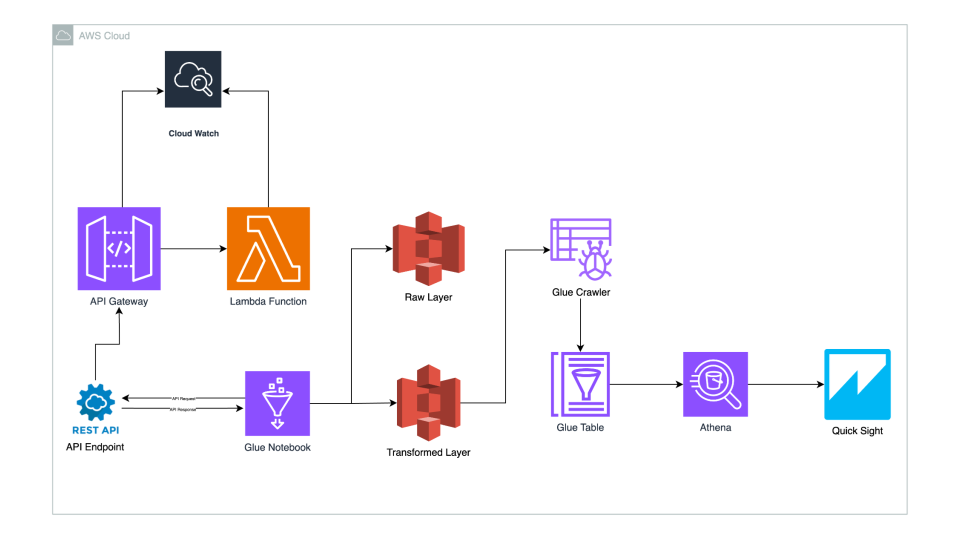

# Sales Data ETL Project | AWS Services

## _📄 Overview_

The **Sales Data ETL Project** is an end-to-end data pipeline designed to:

1. **Generation Sample Data** Sample Data Generation API is hosted using **API Gateway** and **AWS Lambda** which generates data everytime called.
2. **Extracts** sales data from an API.
3. **Transforms** the extracted data using **AWS Glue Notebooks** with PySpark.
4. **Loads** the processed data into AWS S3 across two layers:

- **Raw Layer**: Stores unprocessed data
- **Main Layer**: Stores cleaned, transformed and paritioned data for analytics.

5. Uses **AWS Glue Crawlers** to populate the data into **AWS Glue Catalog Tables**.
6. Queries the data using **AWS Athena** and creates interactive dashboards using **Amazon QuickSight**.

## 📚 Table of Contents

1. [Overview](#📄-overview)
2. [Project Structure](#📁-project-structure)
3. [Features](#🚀-features)
4. [Technologies Used](#🛠️-technologies-used)
5. [Key Highlights](#🌟-key-highlights)
6. [Project Execution Steps](#📜-project-execution-steps)
7. [Dashboard Example](#📊-dashboard-example)
8. [Disclaimer](#⚠️-disclaimer)
9. [Recommendations to avoid unnecessary charges](#💰-recommendations-to-avoid-unnecessary-charges)

## _📁 Project Structure_

sales-data-etl/ ├── lambda.py # Sales Data Generation Logic │ ├── glue_job.ipynb # Uploading Raw Files to S3 ,Data transformation logic and uploading transformed files to S3 │ ├── stores.json # Sample Store names used to data generation │ ├── products.json # Sample products from which sales data is generated │ ├── Architecute.pdf # End to End Project Execution architecute diagram │ ├── vis1.pdf #Dashboard 1 │ ├── vis2.pdf #Dashboard 2 │ ├── README.md # Project Documentation

---

## _🚀 Features_

- **Interactive Glue Notebook** for PySpark transformations.
- Automated extraction, transformation, and loading of data into S3.
- Integration with Athena for querying and QuickSight for visualization.
- Fully managed and serverless architecture.

## _🛠️ Technologies Used_

- **AWS Services**:
  - S3 (Storage)
  - Glue (Notebooks, Crawlers, and Catalog)
  - Athena (Querying)
  - QuickSight (Visualization)
  - IAM (Permissions)
  - API Gateway
  - AWS Lambda
  - Cloud Watch Logs (Logs for Lambda, API Gateway and Glue Notebooks)
- **PySpark** for data transformations in Glue Notebooks.
- **Python** for API integration and automation of data generation.

## _🌟 Key Highlights_

- Automated Data generation using API Gateway, AWS Lambda Function
- Interactive Glue Notebook: PySpark transformations within a fully managed notebook environment.
- Data Organization: Structured separation of raw and transformed data in S3.
- Serverless Analytics: Athena and QuickSight simplify querying and visualization without requiring server setup.

## _📜 Project Execution Steps_

**Step 1: API Gateway & Lambda Integration for Data Generation**

- API Gateway is used to expose an HTTP endpoint that triggers the Lambda function.
- The Lambda function generates sample sales data whenever the API endpoint is called. **Faker** package is used in Lambda function which is created as a layer in Lambda function _[lambda.py](https://github.com/DeviRevanth/Sales-Data-ETL-Project/blob/main/lambda.py)_.

  **Note:** Lambda doesn't support Faker packge it has be installed in local pc compressed and uploaded as a zip file in layer section so that Lambda function can make use of the necessary package folder structure of the zip file has to be as below.

      layer.zip (Zip file name can be any)
      └── python/
      	└── lib/
      		└── python3.x/ x here is the version of Python used in Lambda
      			└── site-packages/
      				└── Faker package to be installed in this location

- Faker and any more package which need to be installed should be uploaded in Lambda Layer as stated above and the be integrated with the Lambda function being worked.
- Ensure json file _[products](https://github.com/DeviRevanth/Sales-Data-ETL-Project/blob/main/products.json)_ and _[stores](https://github.com/DeviRevanth/Sales-Data-ETL-Project/blob/main/stores.json)_ provided are deployed in same Lambda function which holds product names and store names for sample data generation.
- Ensure the API is properly integrated with Lambda so that each API call results in fresh data generation in response.

**Step 2: Data Extraction**

- Use the API to fetch the generated sample sales data.
- The data is extracted and stored in the Raw Layer of AWS S3 in Parquet format.

**Step 3: Data Transformation (AWS Glue Notebooks)**

- Open the AWS Glue Notebook import necessary packages for api requests, data ingestion and transformations. For reference check the notebook -> _[GlueNotebook](https://github.com/DeviRevanth/Sales-Data-ETL-Project/blob/main/glue_job.ipynb)_.
- Save the Raw Data in Raw Layer of S3 for Ingestion history in s3 partions.
- Transform the raw data (e.g., data cleaning and partitioning).
- Save the transformed data into the Main Layer of AWS S3 for analytics.

**Step 4: Cataloging with AWS Glue Crawlers**

- Use AWS Glue Crawlers to detect the schema of the transformed data stored in S3.
- The crawler will automatically update the AWS Glue Catalog Tables with the schema of the processed data.

**Step 5: Data Querying with Athena**

- Use AWS Athena to run SQL queries on the cataloged data stored in S3.
- This allows you to analyze the data and gain insights based on your requirements.

**Step 6: Build Dashboards in QuickSight**

- Integrate AWS Athena queries with Amazon QuickSight to build interactive dashboards.

## _📊 Dashboard Example_

A QuickSight dashboard visualizes key sales metrics like:

- Total Sales.
- Sales per brand.

## _⚠️ Disclaimer_

During the development of this project, I encountered some mistakes that resulted in unexpected charges on my AWS Free Tier account. These include:

**Overuse of DPUs in AWS Glue:**
Running transformations without optimizing the Data Processing Units (DPUs) led to higher costs. Always scale down DPUs when working with smaller datasets.

**Long-Running Glue Jobs:**
Forgetting to terminate AWS Glue development endpoints (like notebooks) after use led to unnecessary billing for idle runtime.
AWS Glue Notebooks Can Incur Charges:

- Using AWS Glue Notebooks under the Free Tier can still incur costs, especially if DPUs are not properly managed or if the notebooks run for extended periods.
- It is essential to monitor DPU usage and job runtimes to prevent unwanted charges.

## _💰 Recommendations to avoid unnecessary charges_

- Always monitor resource usage and free tier limits using the AWS Billing Dashboard.
- Use cost-control mechanisms like AWS Budgets to set alarms for unexpected spending.
- Optimize resources and automate termination of unused services whenever possible.

If you're looking to avoid charges from AWS Glue Notebooks, consider the following alternative solutions:

- AWS Lambda + AWS Step Functions: For lightweight ETL workloads, AWS Lambda can be a cost-effective alternative with proper management of execution time and resource limits.
- Databricks: If you're working with large datasets and need PySpark functionality, Databricks (community edition) offers a free tier for small-scale processing.
- Amazon EMR (Free Tier): You can use Amazon EMR to run Spark jobs within the free-tier.

## _🤝 Contributing_

Contributions are welcome! If you'd like to enhance this project.
